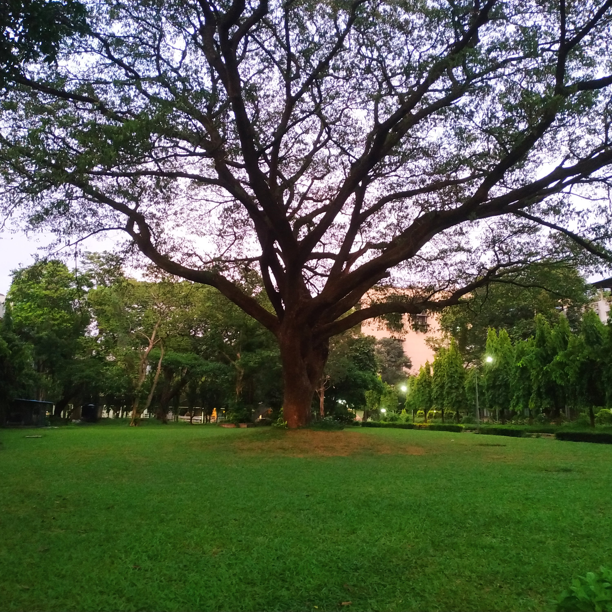
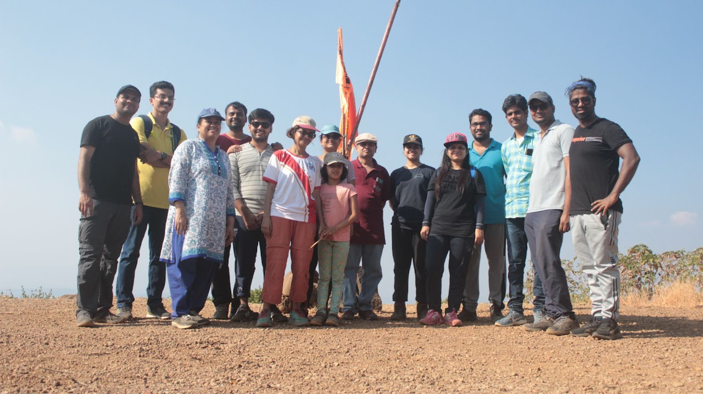
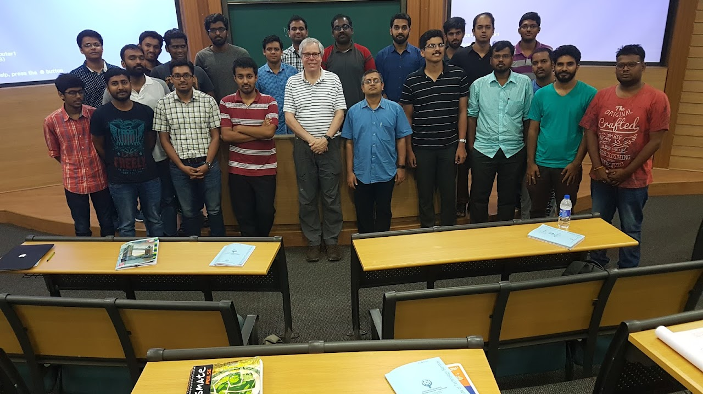

### **Gallery**

  <figure>
    
    <figcaption> Buddha's face (pencil sketch on plastered wall). Restarted a long lost hobby during the Covid lockdown. </figcaption>
  </figure>

  <figure>
    
    <figcaption> When the gulmohars bloom, it is a riot of colour at IIT Bombay! </figcaption>
  </figure>

  <figure>
    
    <figcaption> The grand old tree at IITB campus! </figcaption>
  </figure>

  <figure>
    
    <figcaption> The CMEG group at the summit of Prabalgad trek. </figcaption>
  </figure>

  <figure>
    
    <figcaption> At the end of a week long intensive phase field course by Professor Voorhees. </figcaption>
  </figure>

  <figure>
    
    <figcaption> Trying out Baklawas and other Turkish delights with Oguz's (third from left) guidance in Grenoble.</figcaption>
  </figure>

  <figure>
    
    <figcaption> A selfie with Mona Lisa in Paris! </figcaption>
  </figure>

