### **My Projects**

- [Dislocation assisted phase separation and coarsening](#dislocation-assisted-phase-separation-and-coarsening)
- [Surface diffusion enhanced disintegration of nanowires](#surface-diffusion-enhanced-disintegration-of-nanowires)
- [Equilibrium stacking fault widths of alloys calculated by multiscale DFT PFDD model incorporating GSFE surfaces to free energy functional](#eqilibrium-stacking-fault-widths-of-alloys-calculated-by-multiscale-dft-pfdd-model-icorporating-gsfe-surfaces-to-free-energy-functional )
- [Electron-phonon interaction corrections in total energy of group IV semiconductors](#electron-phonon-interaction-corrections-in-total-energy-of-group-iv-semiconductors)
- [Slip transfer at a boundary in discrete dislocation dynamics simulations](#slip-transfer-at-a-boundary-in-discrete-dislocation-dynamics-simulations)

###### Last updated: October 30, 2024
---

#### **Dislocation assisted phase separation and coarsening**

This project formed the two core chapters of my PhD thesis, on phase separation and coarsening respectively, augmented
by the prescence of dislocations.

First, using a phase field dislocation dynamics model, we looked at the evolution of phases around edge dislocations in an 
elastically homogeneous and isotropic system that had a spinodal in its phase diagram. The presence of straight dislocation 
in such a system with a homogeneous initial composition (outside the spinodal limit) resulted in a segregation-driven 
precipitation at the dislocation. For a striaght dislocation, the precipitate would look like a cylinder 
with a 'cardioid' cross-section.  

<figure align="center">
  
 <figcaption> Solute segregation leads to a cylinder of cardioid section formed along dislocations </figcaption>
</figure>

However, we are missing an important piece of physics in the above result, namely, the faster diffusivity of solutes along a dislocation, 
known in literature as ["pipe diffusion"](https://www.sciencedirect.com/science/article/abs/pii/0001616064902202). 
By assuming the atomic mobility as a function of the dislocation field, 
we incorporated the faster pipe diffusivity in our model using a formulation proposed
by [Zhu et al.](https://journals.aps.org/pre/abstract/10.1103/PhysRevE.60.3564). 

And voila, instead of a long precipitate along the dislocation, we see blobs formed
due to the growth of a composition instability. In other words, a localised spinodal at the dislocation line, in a system 
with an initial composition outside the spinodal limits.  

<figure align="center">
  
  <figcaption> Growth of localised spinodal along the dislocation due to faster pipe diffusivity </figcaption>
</figure>

Essentially, the competition between the growth of the spinodal instability along the dislocation and the segregation 
from the bulk decides the phase transformation mechanism. In the first case, without pipe diffusion, the segregation 
dominates and spinodal fluctuations are killed. However, with pipe diffusivity, the spinodal fluctuations grow at competing 
rates and dominate the phase separation. This is analogous to the classic analysis by 
[Nichols and Mullins](https://pubs.aip.org/iaip/jap/article/36/6/1826/166438/Morphological-Changes-of-a-Surface-of-Revolution) 
which considers the competition between surface and volume diffusion in determining the shape evolution of cylindrical rods.

<figure align="center">
  
  <figcaption> Competition between growing spinodal instability and the solute segregation due to elastic interaction </figcaption>
</figure>

We have also mapped out the parameter space at which spinodal may be expected in systems with miscibility gap. Further, 
prediction of compositions at which localised spinodal might occur has been made for real-world alloys. 

Please check out our publication in Acta Materialia, provided in the [Publications](https://arjunvarmar.github.io/academic/publications) page for more details!

The second project was to look at spherical, coherent precipitates connected by dislocations, in elastically homogeneous and heterogeneous systems, as shown here.
This scenario is pretty common in several systems, where the precipitates remain coherent for longer durations while coarsening. 

<figure align="center">
  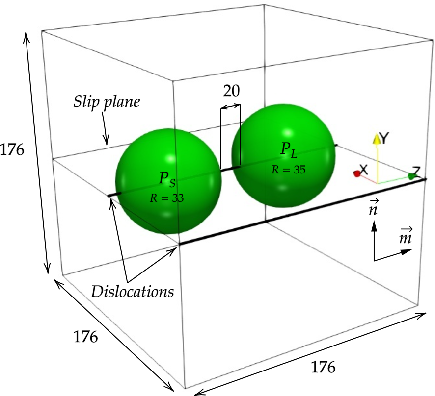
  <figcaption> Spherical precipitates connected by dislocations forming the initial configuration </figcaption>
</figure>

The radii of the two precipitates connected by the dislocationsa are kept at almost similar values, so as to ensure that the larger precipitate grows at the 
expense of the smaller precipitate. The far-field composition in the matrix phase is taken to be equal to the equilibrium concentration (calculated by 
modfied Gibbs-Thomson equation) for the smaller precipitate. 

We then systematically study the coarsening of precipitates as a function of different parameters such as the misfit strain, elastic moduli mismatch, 
faster pipe diffusivity and character of the connecting dislocation. The morphology of the precipitates are altered by elastic interaction 
for the edge connecting dislocation case, leading to slower coarsening kinetics in the edge dislocation case.

<figure align="center">
  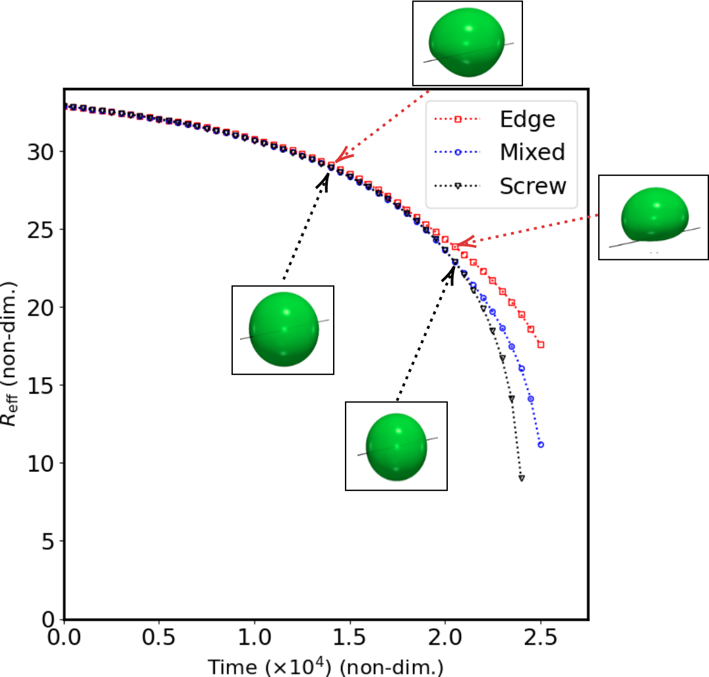
  <figcaption> Different coarsening kinetics for edge, screw and mixed connecting dislocations. The morphology of the shrinking precipiate (P\_S) is also shown. </figcaption>
</figure>

In the elastically homogeneous case, we found that only the edge dislocations elastically interacted with the precipitate, whose misfit was considered to be 
purely dilatational. However, in the elastically inhomogeneous case, we observe the interaction between the deviatoric components of the elastic fields as well.
In addition, we calculated the average solute flux between the two precipitates and show that the apparent diffusivity of the system due to the connecting 
dislocations is the same as the theoretical prediction. Further, the equilibrium compositions at the precipitate-matrix interface are calculated at different points 
on the precipitate using the modified Gibbs-Thomson equation and compared with the compositions from the simulations. 

Please check out our publication in Philosophical Magazine, provided in the [Publications](https://arjunvarmar.github.io/academic/publications) page for more details!  
 

[Back to top](https://arjunvarmar.github.io/projects)

#### **Surface diffusion enhanced disintegration of nanowires**

Metallic nanowires are useful in a wide range of applications, such as, but not limited to, solar cells, flexible and stretchable 
electronic circuits. Hence, their stability is an important consideration, especially at high temperatures. In this study, we considered intersecting nanowires using a simple Cahn-Hilliard model, in which diffusion is assumed to predominantly 
occur at the surface of the wires. Due to surface diffusion, the nanowire junction undergoes a curvature driven material flow, 
snapping the wires at the junctions. After the nanowires break-up at the junction, the remaining parts of the wires also undergo 
disintegration due to Rayleigh instability. 

<figure align="center">
  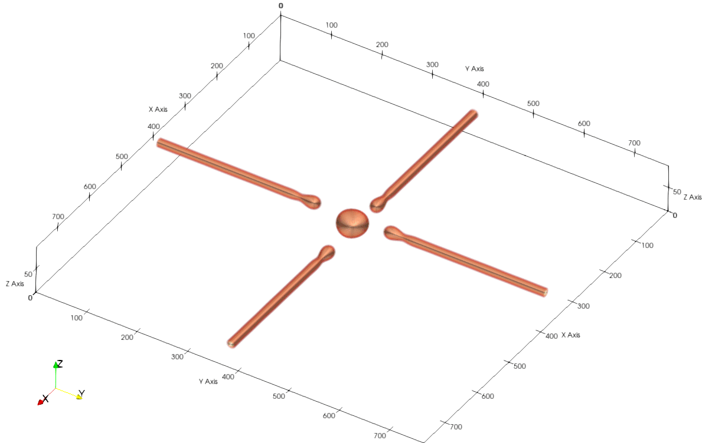
  <figcaption> The intersecting nanowires break-up at the junction, following which they completely disintegrate due to 
  Rayleigh instability </figcaption>
</figure>

The shape of the nanodot formed at the point of intersection depends upon the angle of intersection of the nanowires. The nanodots are also symmetrically aligned along the direction which bisects this angle. 

<figure align="center">
  
  <figcaption> The shape of the nanodot formed at the intersection due to the break-up of the two nanowires </figcaption>
</figure>

Further, the break-up of nanowires were rationalised in terms of their principal curvatures, using interfacial shape distribution 
(ISD) maps. The ISD maps show the evolution of the wires, from the initial cylindrical geometry, to the formation of the spherical nanodots as the wires break. 

<figure align="center">
  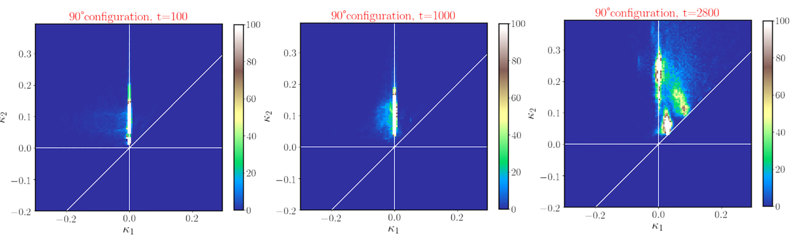
  <figcaption> ISD maps of the nanowires oriented at 90 degrees. From the initial cylindrical configuration of the wires (shown by the stright line along K1=0), the wires disintegrate forming spherical particles, shown by blobs along the K1=K2 line.  </figcaption>
</figure>

For more details, here is a link to our [paper](https://pubs.aip.org/aip/jap/article/130/19/194301/1061998/Phase-field-study-of-surface-diffusion-enhanced)!

[Back to top](https://arjunvarmar.github.io/projects)
#### **Equilibrium stacking fault widths of alloys calculated by multiscale DFT-PFDD model incorporating GSFE surfaces to free energy functional**

One of the most important attractions of modelling dislocations with phase field dislocation dynamics (PFDD) models is the ease of incorporating partial dislocations. 
This is possible by the incorporation of generalised stacking fault energy surfaces (or $$\gamma$$ surfaces) as a term in the total free energy functional. It is possible 
to calculate the generalised stacking fault energy of a metal using density functional theory (DFT) or molecular dynamics (MD) simulations by sliding one layer of atoms above another over different distances and calculating the difference in 
energy. The resulting energy landscape consists of several peaks and valleys corresponding to the crystal structure of the system, as shown for the case of pure Cu in the following figure.

<figure align="center">
  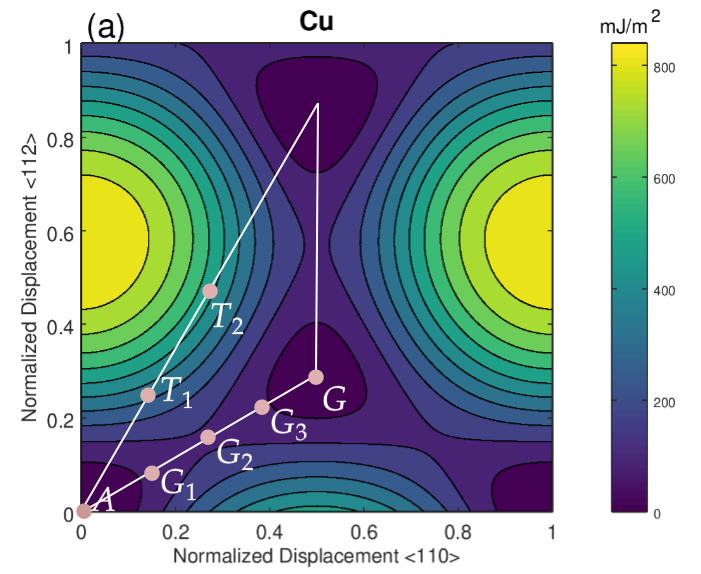
  <figcaption>  Generalised stacking fault energy surface obtained by measuring the energy difference at the seven points A, G1, G2, G3, G, T1 and T. </figcaption>
</figure>

Incorporating the GSFE surface into the free energy functional after the approach by Shen and Wang (2003), it is possible to get a perfect dislocation to dissociate into a leading and a trailing partial dislocation.

  <figure style="text-align: center; flex: 1;">
    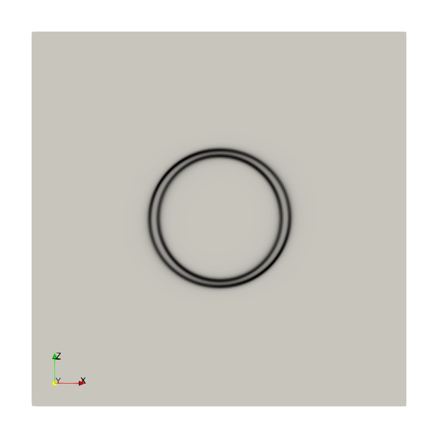
  </figure>

  <figure style="text-align: center; flex: 1;">
    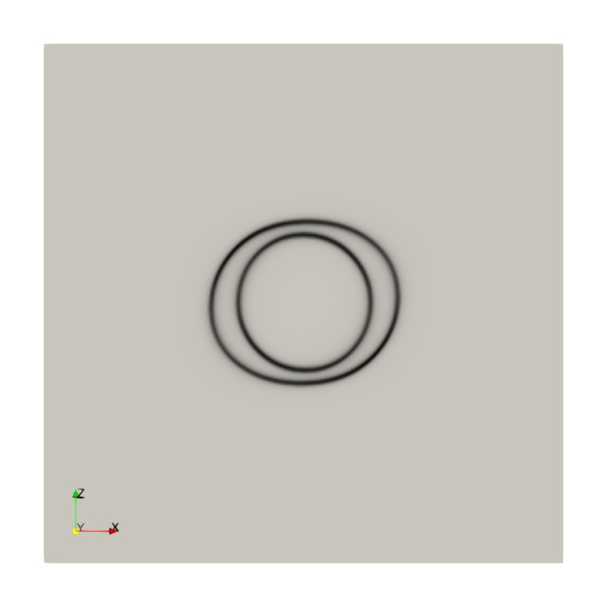
  </figure>

  <figure style="text-align: center; flex: 1;">
    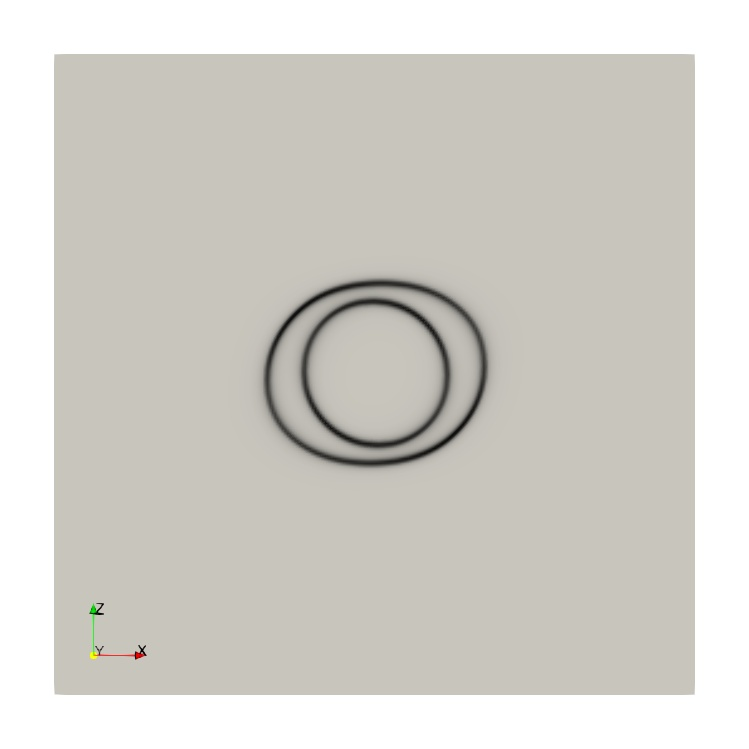
  </figure>

  <figure style="text-align: center; flex: 1;">
    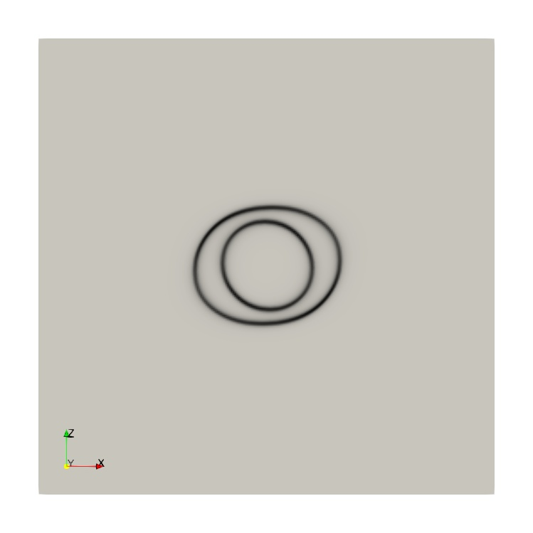
  </figure>

<figcaption style="text-align: center; margin-top: 10px;">Dissociation of a perfect dislocation loop to leading and trailing dislocation loops in pure Cu. The loops shrink and get annihilated in the absence of an external load. </figcaption>

The dislocations are located by taking the derivative of the cumulative displacement that is a combination of all three Burgers vectors in the slip plane. 

<figure align="center">
  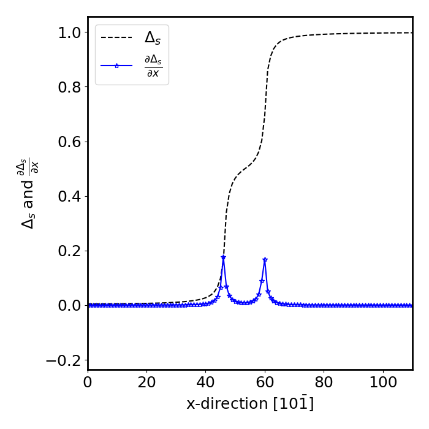
  <figcaption>  The position of the leading and trailing dislocation are obtained by the derivative of the cumulative displacement (sum of Burgers vectors weighted by the order parameter for each slip system)  </figcaption>
</figure>

It is also possible to measure the equilibrium stacking fault of the system using this method. We are currently preparing a manuscript studying the variation in the equilibrium stacking fault width in Cu-Al system at different Al concentrations.

[Back to top](https://arjunvarmar.github.io/projects)

#### **Electron-phonon interaction corrections in total energy of group IV semiconductors**

I started working on this project during the initial years of my PhD, while I was still trying to figure out what my thesis should be on. The core idea and the theoretical basis of this project belongs to Professor T R S Prasanna at MEMS, IITB. Basically, in DFT studies, the stability order of polymorphs is calculated by comparing their total energies, correcting for van der Waals (vdW) and zero-point vibrational energy (ZPVE) contributions. However, the electron-phonon interaction is also important in these calculations and can alter the energy difference between the different polytypes of carbon, silicon and silicon carbide. The incorporation of EPI corrections to the total energy was carried out by building on Allen's formalism for quasiparticle interactions and Allen-Heine theory for electron-phonon interaction contributions at the zero point. It is observed that the EPI contribution is more sensitive to the crystal structure than the other two corrections and is an essential component of the total energy of the system. Although I do not want to claim density functional theory to be an area of my expertise, the experience with this project has made me confident enough to engage in collaboration with DFT experts.

<figure align="center">
  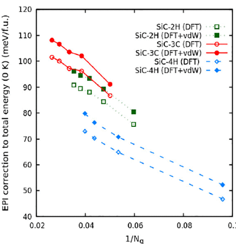
  <figcaption> EPI correction to the total energy as a function of the inverse of number of q-points.  </figcaption>
</figure>

[Back to top](https://arjunvarmar.github.io/projects)
#### **Slip transfer at a boundary in discrete dislocation dynamics simulations**

This project was part of my six month exchange program to Universit\'e Grenoble Alpes. The idea was to incorporate a slip transfer module in the newly developed discrete dislocation dynamics package named NUMODIS and use it to study strain hardening in polycrystalline systems. The expectation was that a parallel version of NUMODIS would be available, from a different project, by the time our project would begin. However, the parallelization project did not go as planned and there was a severe computational constraint to study any realistic system using our slip transfer module.

Here is an example of slip transfer, where new dislocation loops are nucleated at a grain boundary when there is a dislocation pile up in the neighbouring grain. The nucleation of 
dislocations is carried out based on the Lee, Robertson and Birnbaum criteria (known as LRB criteria in slip transmission literature). 

<figure align="center">
  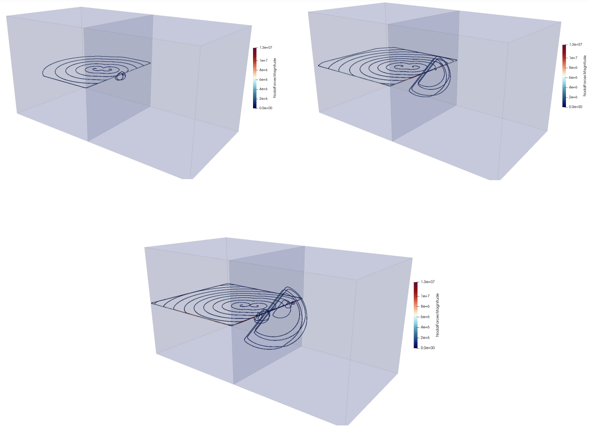
  <figcaption> Slip transfer by dislocation nucleation at the grain boundary due to dislocation pile-up from a Frank-Read source in the neighbouring grain.  </figcaption>
</figure>
[Back to top](https://arjunvarmar.github.io/projects)
