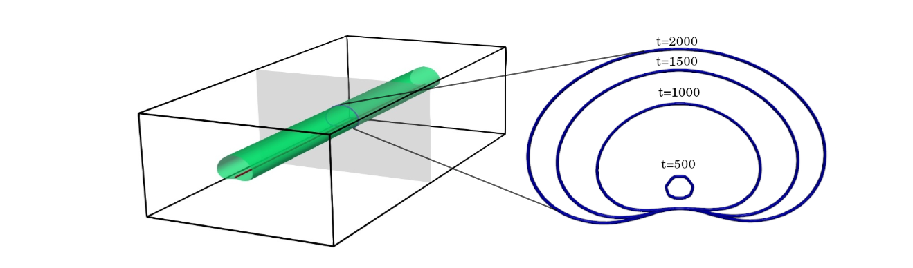

### **My projects**

- [Dislocation assisted phase separation](#dislocation-assisted-phase-separation)
- [Surface diffusion enhanced disintegration of nanowires](#surface-diffusion-enhanced-disintegration-of-nanowires)
- [Effect of generalised stacking fault energy surface on equilibrium stacking fault width in alloys](#effect-of-generalised-stacking-fault-energy-surface-on-equilibrium-stacking-fault-width-in-alloys)
- [Slip transfer at a boundary in discrete dislocation dynamics](#)

###### Last updated: May 4, 2023
---

#### **Dislocation assisted phase separation**

Using a phase field dislocation dynamics model, we look at the evolution of phases around edge dislocations in an 
elastically homogeneous and isotropic system with a miscibility gap. The presence of straight dislocation 
in such a system with a homogeneous initial composition (outside the spinodal limit) would results in a segregation
driven precipitation at the dislocation. For a striaght dislocation, the precipitate would look like a cylinder 
with a 'cardioid' cross-section.  

<figure align="center">
  
 <figcaption> Solute segregation leads to a cylinder of cardioid section formed along dislocations </figcaption>
</figure>

However, we are missing an important piece of physics here, namely, the faster diffusivity of solutes along a dislocation, 
known in literature as ["pipe diffusion"](https://www.sciencedirect.com/science/article/abs/pii/0001616064902202). By assuming the atomic mobility as a function of the dislocation field, 
we incorporated the faster pipe diffusivity in our model using a formulation 
by [Zhu et al.](https://journals.aps.org/pre/abstract/10.1103/PhysRevE.60.3564). 

And voila, instead of a long precipitate along the dislocation, we see blobs formed along the dislocation line, 
due to the growth of a composition instability. In other words, a localised spinodal at the dislocation line, in a system 
with an initial composition outside the spinodal limits.  

<figure align="center">
  
  <figcaption> Growth of localised spinodal along the dislocation due to faster pipe diffusivity </figcaption>
</figure>

Essentially, the competition between the growth of the spinodal instability along the dislocation and the segregation 
from the bulk decides the phase transformation mechanism. In the first case, without pipe diffusion, the segregation 
dominates and spinodal fluctuations are killed. However, with pipe diffusivity, the spinodal fluctuations grow at competing 
rates and dominate the phase separation. This is analogous to the classic analysis by 
[Nichols and Mullins](https://pubs.aip.org/iaip/jap/article/36/6/1826/166438/Morphological-Changes-of-a-Surface-of-Revolution) 
which considers the competition between surface and volume diffusion in determining the shape evolution of cylindrical rods.

<figure align="center">
  
  <figcaption> Competition between growing spinodal instability and the solute segregation due to elastic interaction </figcaption>
</figure>

We have also mapped out the parameter space at which spinodal may be expected in systems with miscibility gap. Further, 
prediction of compositions at which localised spinodal might occur has been made for real-world alloys. 

Please check out our publication in Acta Materialia, provided in the [Publications](https://arjunvarmar.github.io/academic/publications) page for more details!

#### **Surface diffusion enhanced disintegration of nanowires**

Metallic nanowires are useful in a wide range of applications, such as, but not limited to, solar cells, flexible and stretchable 
electronic circuits. Hence, their stability is an important consideration, especially at high temperatures. In this study, we considered intersecting nanowires using a simple Cahn-Hilliard model, in which diffusion is assumed to predominantly 
occur at the surface of the material. Due to surface diffusion, the nanowire junction undergoes a curvature driven material flow, 
snapping the wires at the junctions. After the nanowires break-up at the junction, the remaining parts of the wires also undergo 
disintegration due to Rayleigh instability. 

#### **Effect of generalised stacking fault energy surface on equilibrium stacking fault width in alloys**

#### **Slip transfer at boundaries using discrete dislocation dynamics simulations**